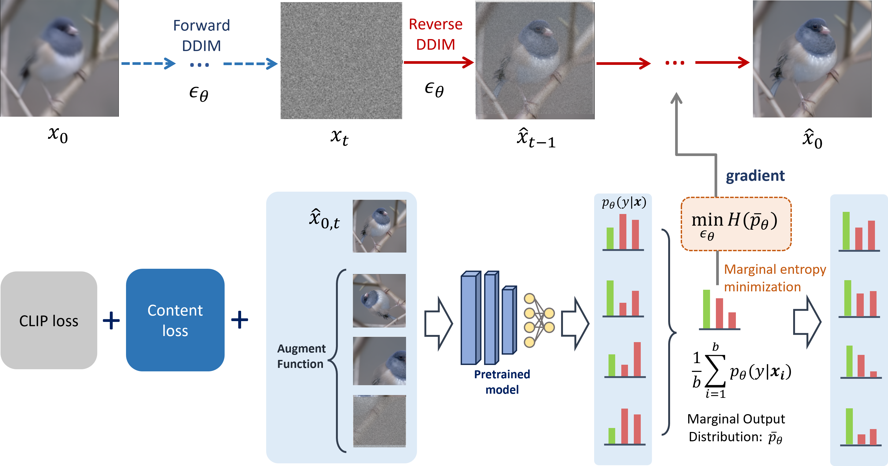

## Amazon Intern Project

### Improving Out-Of-Distribution Robustness for Vision Tasks via Stable Diffusion

- Implementation is based on [Zero-Shot Contrastive Loss for Text-Guided Diffusion Image Style Transfer ](https://arxiv.org/abs/2303.08622).


### Flow of ours proposed method



### Setup project

- Clone submodules:

```
git clone https://github.com/openai/CLIP
git clone https://github.com/ouhenio/guided-diffusion.git
```

- Install submodules dependencies:

```console
pip install -e ./CLIP & pip install -e ./guided-diffusion
```

- Download the unconditional diffusion model (weights 2.06GB):

```console
wget -O unconditional_diffusion.pt https://openaipublic.blob.core.windows.net/diffusion/jul-2021/256x256_diffusion_uncond.pt
```
- put the checkpoint into the "model" folder

### Sampling

Run

```console
cd guided-diffusion
export PYTHONPATH="$PWD:$PYTHONPATH" 
cd ../
CUDA_VISIBLE_DEVICES=0 python main.py --severity 3 --corruption snow --guided_type marginal --ensemble --skip_timesteps 45
```

or Run 
```console
bash scripts/script.sh
```

